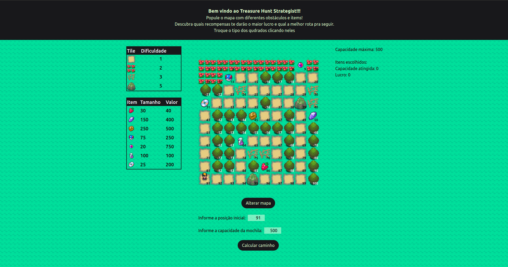
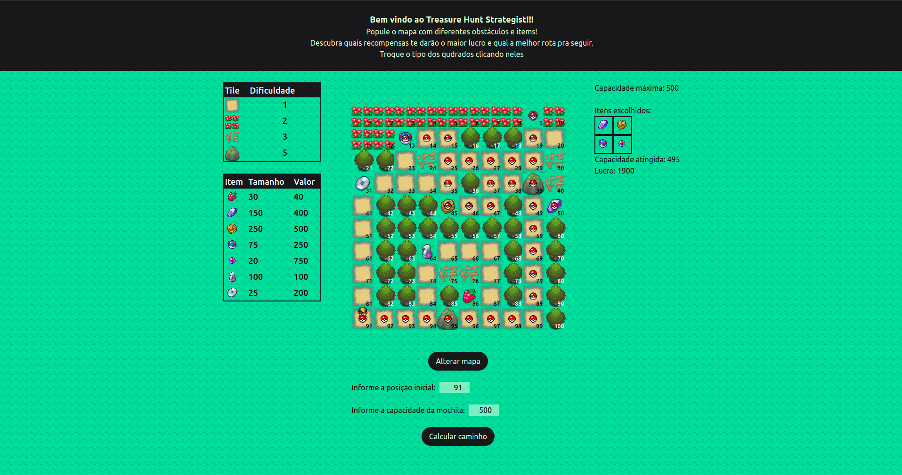
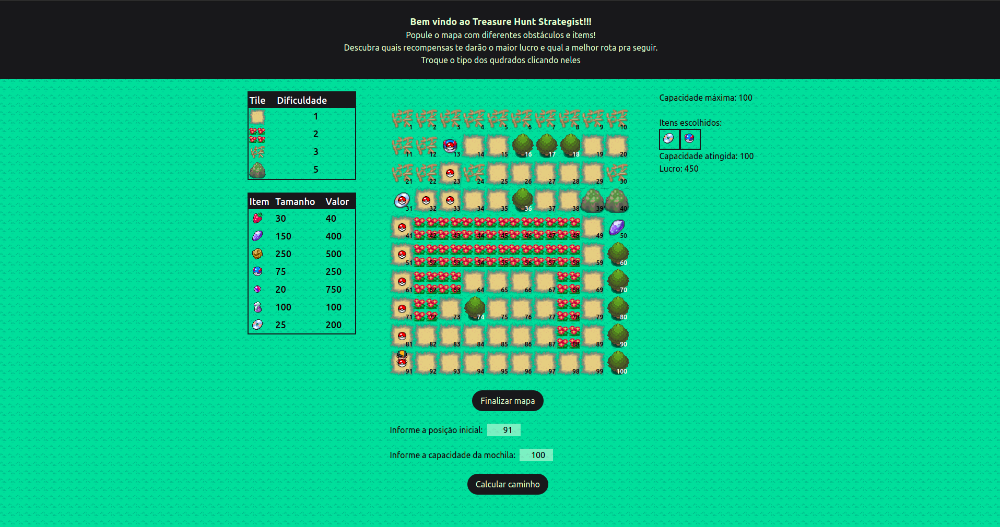

# Treasure Hunt Strategist

**Número da Lista**: 18<br>
**Conteúdo da Disciplina**: Final<br>

## Alunos
|Matrícula | Aluno |
| -- | -- |
| 18/0041592  |  Denys Rógeres |
| 19/0109963  |  João Victor Batista |

## Sobre 
O projeto Treasure Hunt Strategist se trata de um simulador/mini-game 
onde o usuário pode montar um mapa com diversos obstáculos e recompensas. O objetivo é encher sua mochila (de capacidade limitada) com itens de valor de modo a maximizar seus lucros. 

O programa faz uma seleção de quais itens colocar na mochila através de um algoritmo *knapsack* . Uma vez que os itens são escolhidos o programa então busca projetar a rota mais fácil para pegar todos os itens. Ele faz isso através de uma série de buscas *dijkstra* para achar o melhor caminho de um ponto até o próximo.

## Screenshots




## Video de Apresentação

[Video](apresentacao/apresentacao_final.mp4)

## Instalação 
**Linguagem**: Javascript<br>
**Framework**: React<br>

## Requisitos 
- *npm* ou *yarn*
- node v16


## Instalação
Para instalar o projeto, bastar seguir os seguintes comandos:

```
$ git clone https://github.com/jvBatista/Final_TreasureHuntStrategist.git
```

E instalar o projeto com o comando:
```
$ npm install
```

Para inicializar o projeto digite o comando:
```
$ npm run dev
```

ou 

```
$ yarn dev
```


